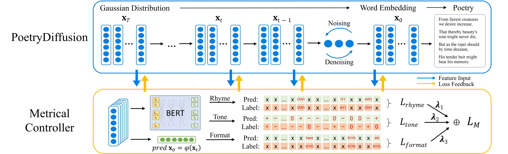

# PoetryDiffusion: Towards Jointly Semantic and Metrical Manipulation in Poetry Generation



Here is the official code of **PoetryDiffusion** for paper [PoetryDiffusion: Towards Jointly Semantic and Metrical Manipulation in Poetry Generation](https://arxiv.org/abs/2306.08456). Built upon the Diffusion model, PoetryDiffusion generates entire sentences or poetry by comprehensively considering the entirety of sentence information. This approach enhances **semantic** expression, distinguishing it from autoregressive and large language models (LLMs). For **metrical** control, the separation feature of diffusion generation and its constraint control module enable us to flexibly incorporate a novel metrical controller to manipulate and evaluate metrics (format and rhythm).


## Conda Setup

```python 
conda install mpi4py
conda install pytorch torchvision torchaudio cudatoolkit=11.3 -c pytorch
pip install -e improved-diffusion/ 
pip install -e transformers/
pip install spacy==3.2.4
pip install datasets==1.8.0 
pip install huggingface_hub==0.4.0 
pip install wandb
```


## Train Diffusion Model

Introduced in Section **3.2 Diffusion Based Framework**, we should first train the Diffusion model as the semantic framework.

```
cd bash
bash ci_diffusion.sh	# or: bash sonnet_diffusion.sh
```


## Generate Poetry without Control

After training the Diffusion model, we can generate poems without control following the instructions below.

```
cd bash
bash decode.sh
```


## Generate Rhythmically Controlled Poetry

First, train the Metrical Controller used to guide the generation (e.g. tone in SongCi) 

```
cd bash
bash ci_classifier.sh
```

Then, we can use the trained Metrical Controller to guide generation. 

```
cd bash
bash ci_control.sh
```


## Citation

Please cite the associated paper and star this repository if you find PoetryDiffusion interesting or useful in your work. Your support is greatly appreciated! Don't hesitate to open an issue if you have any questions.

```
@misc{hu2023poetrydiffusion,
      title={PoetryDiffusion: Towards Joint Semantic and Metrical Manipulation in Poetry Generation}, 
      author={Zhiyuan Hu and Chumin Liu and Yue Feng and Anh Tuan Luu and Bryan Hooi},
      year={2023},
      eprint={2306.08456},
      archivePrefix={arXiv},
      primaryClass={cs.CL}
}
```

